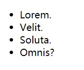

# 网页设计

URL:<https://developer.mozilla.org/zh-CN/docs/Web/HTML/Element>

## 对论坛前端的基本设计

1. 元素+mdn,进行网站查找
2. css决定网站的具体颜色、形状
3. HTML、CSS -> 浏览器（主要是内核） -> 页面

## 关于插件

```插件名称
vscode-icons
markdownpreview
LiveSever
```

## 基础语言

注释格式

```html
<!---注释--->
ctrl+?
```

元素 = 起始标记（begin tag） + 结束标记（end tag） + 元素内容 + 元素属性

```exp
<!-- <a>指超连接文本 -->
<a href="http://www.baidu.com" title="打开百度">某一网页</a>
```

全局属性：所有元素通用

```html
<title></title>
<h1 title='www'>一级标题</h1>
```

有些元素没有结束标记，这样的元素叫做：**空元素**

空元素的两种写法：

1. ```<meta charset="UTF-8">```
2. ```<meta charset="UTF-8" />```
第二种写法，html5可以不加最后的/

### 元素的嵌套

元素不能相互嵌套

```exp
类似于括号的使用
开始与结束的标识符必须明确分开
```

文档声明，告诉浏览器，当前文档使用的HTML标准是HTML5。

```html
<!DOCTYPE html>
直接写html表示最新版的版本(5)
```

根元素，一个页面最多只能一个，并且该元素是所有其他元素的父元素或祖先元素。

```rootelem
<html lang="en">
```

1. HTML5版本中没有强制要求书写该元素
2. lang属性：language，全局属性，表示该元素内部使用的文字是使用哪一种自然语言书写而成的。

文档头，文档头内部的内容，不会显示到页面上。

```html
<head>

</head>
```

文档的元数据：附加信息。

```html
<meta>
<meta charset="UTF-8">
charset 表示字符编码表的类型
```

文档体，页面上所有要参与显示的元素，都应该放置到文档体中。

```html
<body>
</body>
```

## 语义化

1. 每一个HTML元素都有具体的含义
a元素：超链接
p元素：段落
h1元素：一级标题

2. 所有元素与展示效果无关
元素展示到页面中的效果，应该由CSS决定。
因为浏览器带有默认的CSS样式，所以每个元素有一些默认样式。

```tip
选中后 ctrl+d对相同元素进行修改
```

**重要：选择什么元素，取决于内容的含义，而不是显示出的效果**
为什么需要语义化？

```ans
1. 为了搜索引擎优化（SEO）

搜索引擎：百度、搜搜、Bing、Google

每隔一段时间，搜索引擎会从整个互联网中，抓取页面源代码
2. 为了让浏览器理解网页

阅读模式、语音模式
```

自动生成6个标题

```title
h1*6>{$级标题}
```

### span【无语义】

没有语义，仅用于设置样式
> 以前：某些元素在显示时会独占一行（块级元素），而某些元素不会（行级元素）
> 到了HTML5，已经弃用这种说法。

### pre

1. 预格式化文本元素，在pre元素中的内容不会出现空白折叠

2. (默认)空白折叠：在源代码中的连续空白字符（空格、换行、制表），在页面显示时，会被折叠为一个空格
3. 该元素通常用于在网页中显示一些代码。
4. 实际上是一个默认的css属性

```code
<code>
    <pre>
      char a='a';
      a=z-65+a;
    </pre>
</code>
  加缩进全选+TAB
  减缩进shift+TAB
```

> 显示代码时，通常外面套code元素，code表示代码区域。

## HTML实体

```mdn
mdn
实体字符， HTML Entity
```

在页面中显示一些特殊符号。
>防止功能性的符号造成显示错误

1. &单词;
2. &#数字;

- 小于符号<
&lt;

- 大于符号>
&gt;

- 空格符号
&nbsp;

- 版权符号©
&copy;

- &符号
&amp;

1. a元素 超链接
2. href属性

hyper reference：通常表示跳转地址
***lorem + 单词数量***

1. 普通链接
2. 锚链接
id属性：全局属性，表示元素在文档中的唯一编号

```属性
a[herif="#chapter$"]*6>{章节$}
((h2[id="chapter$"]>{章节$})+p>lorem100)*6
 <a href="#">回到顶部</a>
```

 可以通过<!--<a href="锚链接.html">"-->直接从某个网页的某处跳转到另一网页的某处
3.功能链接
点击后，触发某个功能

- 执行JS代码，javascript:
- 发送邮件，mailto:

>要求用户计算机上安装有邮件发送软件：exchange

- 拨号，tel:

>要求用户计算机上安装有拨号软件，或使用的是移动端访问

```exp
    <a href="javascript:alert('你好！')">
        弹出：你好！
    </a>

    <a href="mailto:234234324324@qq.com">
        点击给我发送邮件
    </a>

```

## target属性

表示跳转窗口位置。

target的取值：

- _blank 在新窗口中打开被链接文档(打开新的页面)。
- _self 默认。在相同的框架中打开被链接文档。(覆盖当前页面)
- _parent 在父框架集中打开被链接文档。
- _top 在整个窗口中打开被链接文档。
- framename 在指定的框架中打开被链接文档。

```exp
 <a href="https://douyu.com" target="_blank" title="斗鱼，每个人的直播平台">
        斗鱼直播
    </a>
```

## 路径的写法

绝对路径和相对路径
(站内资源及站外资源的访问方法)

当跳转目标和当前页面的协议相同时，可以省略协议
以./开头，./表示当前资源所在的目录
可以书写../表示返回上一级目录
相对路径中：./可以省略

## 插入图片

### image

>和超链接a元素联用
注意：

1. href：跳转到目的网页
2. src属性：source
3. alt属性：当图片资源失效时，将使用该属性的文字替代图片

```exp

<figure>
        <a target="_blank" href="https://baike.baidu.com/item/%E5%A4%AA%E9%98%B3%E7%B3%BB/173281?fr=aladdin">
            
            <!-- image缩写，空元素;src属性：source;alt属性：当图片资源失效时，将使用该属性的文字替代图片 -->
        </a>
        <figcaption>
            <h2>太阳系</h2>
        </figcaption>
        <p>
            太阳系是以太阳为中心，和所有受到太阳的引力约束天体的集合体。
        </p>
    </figure>

<!-- 为了让图片和之后的相关操作联系起来 -->
<!-- 
然后在相关操作中使用
<!-- <map name="solarMap"> -->

```

### map:地图

````map
<map name="solarMap">
        <area shape="circle" coords="360,204,48" href="https://baike.baidu.com" target="_blank">
        <area shape="rect" coords="323,282,395,320" href="https://baike.baidu.com/" target="_blank">
        <area shape="poly" coords="601,371,645,312,678,338,645,392" href="https://baike.baidu.com" target="_blank">
    </map>

    circle coords="Ox,Oy,R"
    rectangular coords="X_left_up,y_left_up,x__right_down,y__right_down"
    poly coords="x1,y1,xi,yi...xn,yn"
```
#### <figure> 元素表一段独立的内容, 经常与说明（caption） <figcaption> 配合使用,

```figure
<figure>
    
    <figcaption>An elephant at sunset</figcaption>
</figure>
```
```
<!-- Just an image -->
<figure>
  
</figure>
<!-- Image with a caption -->
<figure>
   <figcaption>MDN Logo</figcaption>
</figure>
```

## 多媒体文件

1. video 视频
2. audio 音频

> 某些属性(controls自动播放\muted静音播放\loop循环播放),控制控件的显示，只有两种状态：
>1. 不写
>2. 取值为属性名，这种属性叫做布尔属性,在HTML5中，可以不用书写属性值
```
1. 旧版本的浏览器不支持这两个元素
2. 不同的浏览器支持的音视频格式可能不一致
（usually:mp4、webm(兼容性较好)）
```
## 有序列表

ol: ordered list
li：list item
```
 <ol reversed>
        <li>打开冰箱门</li>
        <li>大象进去</li>
 </ol>
```
## 无序列表



把ol改成ul
ul：unordered list
无序列表常用于制作菜单 或 新闻列表。
```
<!-- ul>li*4>lorem1 -->
 <ul>
        <li>有</li>
        <li>有</li>
 </ul>
```
## 定义列表

通常用于一些术语的定义

dl: definition list
dt: definition title
dd: definition description

> HTML <dl> 元素 （或 HTML 描述列表元素）是一个包含术语定义以及描述的列表，通常用于展示词汇表或者元数据 (键-值对列表)。 在 HTML5 之前， <dl> 被大家以定义列表所熟知

> 默认dd列表内容会一定缩进
```
    <dl>
        <dt>HTML</dt>
        <dd>
            超文本标记语言，XXXXXX
        </dd>

        <dt>元素</dt>
        <dd>
            组成HTML文档的单元，每个xxxxx
        </dd>
    </dl>
```
## 容器元素

容器元素：该元素代表一个块区域，内部用于放置其他元素(可展开适的模块，内置菜单)

> div

### 语义化容器元素

>header: 通常用于表示页头，也可以用于表示文章的头部

>footer: 通常用于表示页脚，也可以用于表示文章的尾部

>article: 通常用于表示整篇文章

>section: 通常用于表示文章的章节

>aside: 通常用于表示侧边栏

## 元素及包含关系
以前，块级换行，行级不换行，块级元素可以包含行级元素，行级元素不可以包含块级元素，a元素除外
现在:元素的包含关系由元素的内容类别决定。

h1元素中不可以可以包含p元素，p中也不可以包含h1元素
即，标题中不包含段落，段落中不包含标题
***二者都属于块级元素***
(块级元素：div\article\header\pre\ol\p)

总结：
```
1. 容器元素中可以包含任何元素
2. a元素中几乎可以包含任何元素
3. 某些元素有固定的子元素（ul>li，ol>li，dl>dt+dd）
4. 标题元素和段落元素不能相互嵌套，并且不能包含容器元素
```
